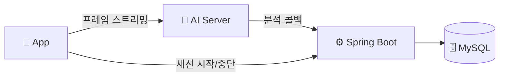
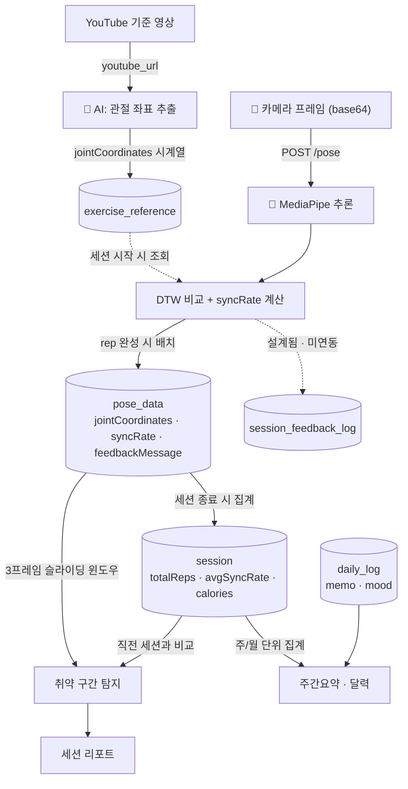
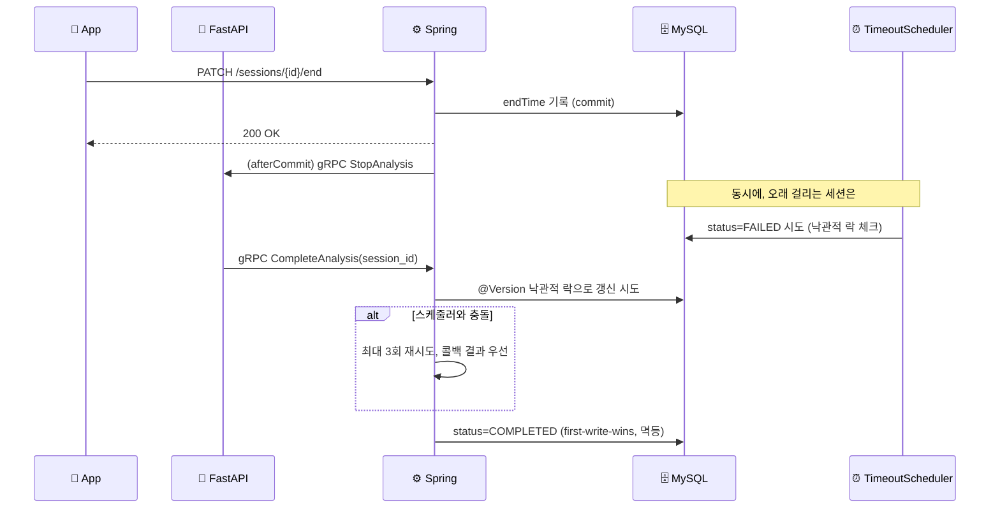

# ShadowFit — Backend (Spring)

**"시계열 쓰기-헤비 워크로드 위에서, 두 서비스에 걸친 운동 세션 상태를 동시성 정합성 있게 관리하고, 그 데이터 계층을 production 기준으로 깊게 엔지니어링한 백엔드."**

---

## 아키텍처

프론트는 카메라 프레임을 AI 서버에 직접 스트리밍하고, AI 서버는 gRPC 콜백으로 결과를 Spring에 전달합니다. 세션 시작/중단만 프론트→Spring→AI로 한 단계 거칩니다.

## 데이터 플로우

카메라 프레임은 AI 서버 내부에서 관절 좌표로 변환된 뒤 rep 단위로만 Spring에 저장되고, 세션 리포트·주간요약·달력은 모두 이 `pose_data`/`session` 테이블에서 파생됩니다.

## 대표 API

| Method | Endpoint | 설명 |
| :--- | :--- | :--- |
| `POST` | `/exercises/sessions` | 운동 세션 시작 (DB 생성 후 202 즉시 응답, gRPC 송신은 비동기) |
| `PATCH` | `/sessions/{sessionId}/end` | 세션 종료 (단일 엔드포인트, 커밋 후 AI에 비동기 통보) |
| `POST` | `/exercises/{exerciseId}/reference` | YouTube 기준 동작 좌표 추출 요청 |
| `GET` `PATCH` | `/preferences/tts` | TTS 사용 여부·속도 조회/변경 |
| `GET` | `/exercises/{exerciseId}/feedback-templates` | 운동별 피드백 멘트 조회 |
| `GET` | `/reports/calendar` | 달력 기반 월별 운동 기록 |
| `GET` | `/reports/weekly-summary` | 주간 활동 요약 |
| `POST` | `/reports/daily-logs` | 운동 일지 작성 |
| `GET` | `/reports/session/{sessionId}` | 세션별 상세 리포트(취약 구간·이전 세션 비교) |
| `PATCH` | `/admin/exercises/{exerciseId}/thresholds` | 페르소나별 싱크로율 임계값 조정 (관리자) |

전체 스펙은 로컬 기동 후 Swagger(`/swagger-ui`)에서 확인할 수 있습니다.

---

## 헤드라인 — 운동 세션 생명주기의 분산 정합성

**문제**: 운동 세션 상태가 Spring(Java)과 FastAPI(Python) 두 서비스에 걸쳐 있습니다. 세션 종료 시점에 서로 다른 두 주체가 같은 레코드를 동시에 건드릴 수 있습니다.
- **타임아웃 스케줄러**(`SessionTimeoutScheduler`): "너무 오래 안 끝남 → `FAILED`"
- **FastAPI 완료 콜백**(gRPC `CompleteAnalysis`): "분석 끝남 → `COMPLETED`"

**해결(실제 코드)**: DB 커밋이 확정된 뒤에야 AI로 gRPC를 쏩니다. `SessionService.endSession`이 `TransactionSynchronization.afterCommit`에서 `analysisService.stopAnalysis`를 호출하는 식으로 짜서, 트랜잭션 안에 외부 호출이 끼지 않게 했습니다.

충돌 감지는 `Session` 엔티티의 `@Version` 낙관적 락으로 합니다. 스케줄러와 콜백이 동시에 갱신을 시도하면 낙관적 락 예외가 나고, `completeSession`은 이때 최대 3회 재시도하면서 콜백(AI) 쪽 결과를 우선합니다.

수신 쪽은 멱등하게 짰습니다. `applyComplete`는 세션이 이미 `COMPLETED`면 그냥 반환하고(first-write-wins), 네트워크 재시도로 같은 콜백이 중복 도착해도 문제없습니다.

**직접 재현·검증**: 같은 패턴(동시 read-modify-write)을 별도 스크립트로 재현해봤습니다. naive read-modify-write는 갱신이 유실(commit 순서에 따라 두 값 중 하나만 남음)되지만, 원자적 UPDATE·비관적 락(`SELECT ... FOR UPDATE`)·낙관적 락(CAS) 세 가지 방식은 모두 정확한 값을 복구한다는 걸 `performance_schema.data_locks`로 락 상태까지 관찰해 확인했습니다. MVCC 격리수준(REPEATABLE READ vs READ COMMITTED vs SERIALIZABLE)도 같은 방식으로 비교해서, RC만으로는 lost-update를 막지 못한다는 것과 SERIALIZABLE이 읽기까지 잠가 직렬화 비용을 만든다는 것을 직접 관찰했습니다.

> 동시성을 처리했다는 게 포인트가 아니라, 왜 낙관적 락을 골랐는지(저경합·블로킹 회피)를 실험으로 보여주고 싶었습니다. 흔한 "선착순 쿠폰" 예제로 동시성을 붙이는 대신, 두 서비스 경계에서 자연스럽게 발생하는 동시성 문제를 찾아 발동/미발동으로 갈라 측정했다는 점이 다릅니다.

---

## DB 엔지니어링 실험 (RealMySQL 8.0 기준)

전제: DAU 1,000명을 가정한 합성 데이터로 `pose_data` 테이블에 **1억 행(133,334세션 × 750행, ~11GB)**을 시딩해 실험했습니다. 절대 처리량 숫자는 개발 환경(물리 2코어) 종속이라 신뢰하지 않고, 메커니즘과 상대적 개선폭(before/after) 위주로 봐주시면 됩니다.

| 실험 | 발견 | 수치 |
| :--- | :--- | :--- |
| **인덱스 검증** | "인덱스 추가하면 빨라진다"는 가설을 먼저 세웠으나, `EXPLAIN ANALYZE`로 이미 최적(covering index, filesort 없음)임을 확인하고 가설을 폐기. 강제 풀스캔과 대조해 인덱스의 실제 역할을 검증했습니다 | 인덱스 스캔 vs 강제 풀스캔 **4.1M 행 = 85초** |
| **배치 INSERT** | `JdbcTemplate.batchUpdate`로 전환(JPA `saveAll`은 `IDENTITY` PK 때문에 Hibernate batch가 원천 차단되는 걸 확인한 뒤 우회) | throughput **+99%**, p99 **−37%** |
| **Projection (JSON off-page)** | 리포트 조회가 쓰지도 않는 JSON 컬럼(2.3KB)까지 통째로 로드하고 있었습니다. JSON이 InnoDB off-page(오버플로우 페이지)에 저장돼 추가 랜덤 I/O가 발생한다는 걸 확인하고 3컬럼 projection으로 바꿨습니다 | payload **1,716.8KB → 22.4KB (−98.7%)**, 쿼리 **12.1ms → 1.5ms** |
| **페이지네이션 (offset vs keyset)** | 1억 행 위에서 offset은 깊이에 비례해 선형으로 느려지고(O(N)), keyset(cursor)은 깊이와 무관하게 평탄하다는 걸 실측했습니다 | offset 5,000만 지점 **26초** vs keyset **0.05ms** |
| **파티셔닝 (TTL 용도)** | 세션 단위 조회는 파티션 pruning 이득이 0이라는 걸 먼저 확인해서 "1억 행이니까 파티션"이라는 가설부터 접었습니다. 유일하게 남는 정당화는 오래된 raw 데이터를 버리는 TTL 용도였습니다 | 동일 ~800만 행 만료: `DELETE` **18.6분**(빈 파일 잔존) vs `DROP PARTITION` **1.8초** |
| **버퍼풀 / read-ahead 함정** | 순차 스캔에서 InnoDB read-ahead가 표준 hit율 공식(1−reads/read_requests)을 왜곡해 거짓으로 99%대를 보여준다는 걸 발견했습니다. 실제 물리 I/O는 바이트 단위 지표로 봐야 합니다 | 작업셋(540MB) > 버퍼풀(128MB) → warm에도 매번 ~485MB 재읽기 |
| **JSON 트림** | MediaPipe가 33개 관절을 전부 저장하지만 실제 사용은 13개뿐이라는 걸 코드로 확인하고, 사용 컬럼만 추출했습니다 | 평균 페이로드 **2,344B → 916B (−60.9%)** |

> 한계: 합성 데이터가 단일 템플릿 복제라 값 분포(카디널리티)는 균일합니다. 행수·payload 크기에 의존하는 위 실험들은 유효하지만, 값 분포에 의존하는 실험(선택도, 옵티마이저 카디널리티 추정)은 의도적으로 하지 않았습니다.

---

## 보강 축 — 아직 남은 갭

컴포넌트별 실패 모드를 먼저 카탈로그화(트리거 → blast radius → 감지 → 현재 완화 → 갭)한 뒤, 그 갭을 보강 우선순위로 정리했습니다.

| 축 | 현재 상태 |
| :--- | :--- |
| **신뢰성(전달 의미론)** | 🔶 멱등 수신은 있지만(재전송 안전), 세션 종료 통보(afterCommit gRPC)는 fire-and-forget(`onError` 로그만)이라 at-most-once — 유실 가능합니다. Outbox 패턴으로 at-least-once 송신을 붙이고 기존 멱등 수신과 합쳐 exactly-once로 가는 게 다음 과제입니다 |
| **회복탄력성** | 🔶 gRPC 호출에 deadline·서킷브레이커가 없습니다. AI 서버가 느려지거나 죽으면 그대로 영향받을 수 있습니다 |
| **관측성** | 🔴 구조화 로깅·correlation id 전파·헬스체크 메트릭이 비어있습니다 |
| **캐싱** | 🔶 설계만 끝냈고(카탈로그성 데이터는 cache-aside + Caffeine, 다중 인스턴스 시 Redis로 전환) 아직 구현은 안 했습니다 |
| **보안** | 🟢 JWT + Refresh Token + blacklist + BCrypt + role 기반 인가 |

이 표를 만든 목적은 "다 막았다"를 보여주려는 게 아니라, 뭐가 어떻게 깨질 수 있고 뭘 아직 안 막았는지 스스로 파악해두는 데 있습니다.

---

## 한계와 포지셔닝

MediaPipe 자세 추출, DTW 비교, TTS는 앱의 기능이지 제 백엔드 실력을 증명하는 대상은 아닙니다. 위 내용은 전부 Spring/MySQL 쪽입니다.

"동시 사용자가 적어서 어차피 드물다"로 넘어가지 않고, DAU 1,000명이라는 구체적인 가정을 못 박은 뒤 그 기준으로 동시성과 부하를 설계했습니다. 다만 이건 정합성 메커니즘을 증명하기 위한 가정이고, "N 동시 부하에서 TPS 얼마 나왔다"를 자랑하는 것과는 다릅니다(측정은 단일 클라이언트 기준입니다).

합성 데이터의 값 분포가 균일하다는 한계는 인지하고 있고, 그 분포에 의존하는 실험(선택도, 옵티마이저 카디널리티 추정 등)은 하지 않았습니다.

로컬 물리 2코어(i3-6100) 환경에 MySQL·백엔드·부하 생성기가 같이 떠 있어서, 절대 RPS·처리량 수치는 그 환경에 묶여 있습니다. 위에서 인용한 수치는 절대값이 아니라 어떤 메커니즘이 왜 더 빠른지, 전후 비교 폭이 얼마인지로만 봐주시면 됩니다.

MySQL이 이 워크로드에 기술적으로 유리하다는 주장 세 가지(클러스터드 인덱스, 파티션 DROP, JSON off-page)를 직접 검토해봤는데, PostgreSQL도 동등한 메커니즘(힙 테이블의 자연스러운 append, 선언적 파티셔닝의 DETACH+DROP, TOAST)을 갖고 있어서 과장이었다는 걸 인정합니다. MySQL을 계속 쓰는 진짜 이유는 기술 우위가 아니라, 이미 이 수치들로 실측·문서화해둔 자산이 있고 국내 백엔드 신입 채용에서 흔히 쓰는 스택이기 때문입니다.

---

## 기술 스택

**적재/부하 측정**: `ghz`(gRPC 부하), `performance_schema`/`sys`(락·I/O 관측), `EXPLAIN ANALYZE`

---
