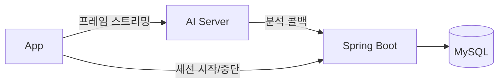
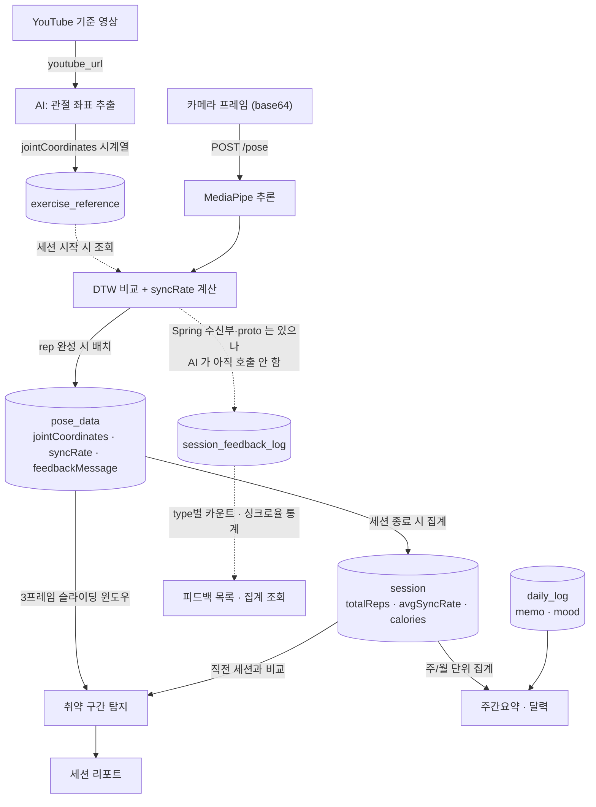
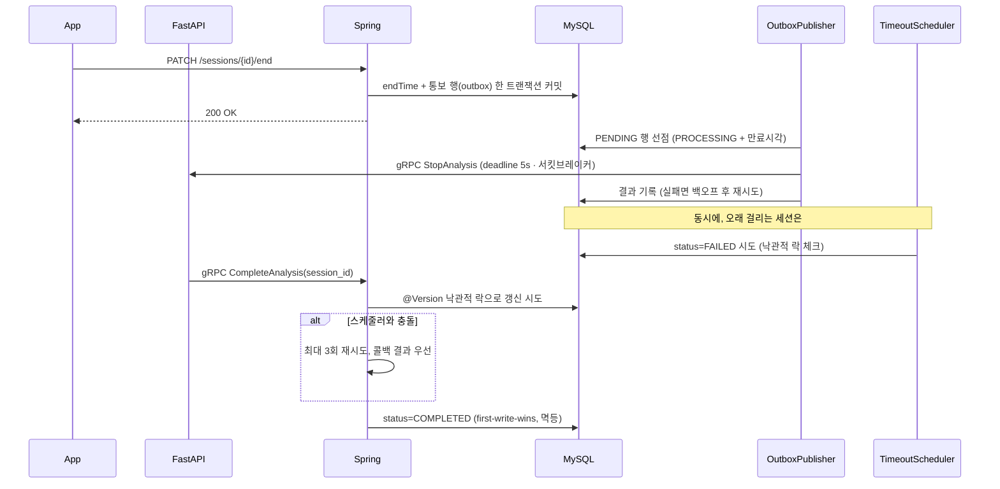

# ShadowFit Backend (Spring)

**"시계열 쓰기-헤비 워크로드 위에서, 두 서비스에 걸친 운동 세션 상태를 동시성 정합성 있게 관리하고, 그 데이터 계층을 production 기준으로 깊게 엔지니어링한 백엔드."**

---

## 기술 스택

**적재/부하 측정**: `ghz`(gRPC 부하), `performance_schema`/`sys`(락·I/O 관측), `EXPLAIN ANALYZE`

---

## 아키텍처

```mermaid
graph LR
    FE["App"]
    AI["AI Server"]
    BE["Spring Boot"]
    DB[("MySQL")]

    FE -- "프레임 스트리밍" --> AI
    AI -- "분석 콜백" --> BE
    FE -- "세션 시작/중단" --> BE
    BE --> DB
```

프론트는 카메라 프레임을 AI 서버에 직접 스트리밍하고, AI 서버는 gRPC 콜백으로 결과를 Spring에 전달합니다. 세션 시작/중단만 프론트→Spring→AI로 한 단계 거칩니다.

## 데이터 플로우

```mermaid
flowchart TD
    YT["YouTube 기준 영상"] -->|"youtube_url"| Extract["AI: 관절 좌표 추출"]
    Extract -->|"jointCoordinates 시계열"| RefDB[("exercise_reference")]

    Cam["카메라 프레임 (base64)"] -->|"POST /pose"| MP["MediaPipe 추론"]
    RefDB -.->|"세션 시작 시 조회"| DTW
    MP --> DTW["DTW 비교 + syncRate 계산"]
    DTW -->|"rep 완성 시 배치"| PoseDB[("pose_data<br/>jointCoordinates · syncRate · feedbackMessage")]
    DTW -.->|"Spring 수신부·proto 는 있으나<br/>AI 가 아직 호출 안 함"| FeedbackDB[("session_feedback_log")]

    PoseDB -->|"세션 종료 시 집계"| SessionDB[("session<br/>totalReps · avgSyncRate · calories")]
    FeedbackDB -.->|"type별 카운트 · 싱크로율 통계"| FbApi["피드백 목록 · 집계 조회"]

    PoseDB -->|"3프레임 슬라이딩 윈도우"| Weak["취약 구간 탐지"]
    SessionDB -->|"직전 세션과 비교"| Weak
    Weak --> Report["세션 리포트"]
    SessionDB -->|"주/월 단위 집계"| Weekly["주간요약 · 달력"]
    DailyLogDB[("daily_log<br/>memo · mood")] --> Weekly
```

카메라 프레임은 AI 서버 내부에서 관절 좌표로 변환된 뒤 rep 단위로만 Spring에 저장되고, 세션 리포트·주간요약·달력은 모두 이 `pose_data`/`session` 테이블에서 파생됩니다.

## 대표 API

| Method | Endpoint | 설명 |
| :--- | :--- | :--- |
| `POST` | `/exercises/sessions` | 운동 세션 시작 (DB 생성 후 202 즉시 응답, gRPC 송신은 비동기) |
| `PATCH` | `/sessions/{sessionId}/end` | 세션 종료 (단일 엔드포인트, 통보는 아웃박스로 위임) |
| `GET` | `/sessions/active` | 진행 중인 세션 조회 (앱 재진입 시 복구용) |
| `POST` | `/sessions/{sessionId}/reattach` | 세션 재부착 (이어하기) |
| `DELETE` | `/sessions/{sessionId}` | 세션 삭제 |
| `GET` | `/sessions/{sessionId}/feedbacks` | 세션의 피드백 이벤트 목록 (※ 아래 참고) |
| `GET` | `/sessions/{sessionId}/feedback-summary` | 피드백 집계 — type별 카운트 + 싱크로율 통계 (※) |
| `POST` | `/exercises/{exerciseId}/reference` | YouTube 기준 동작 좌표 추출 요청 |
| `GET` `PATCH` | `/preferences/tts` | TTS 사용 여부·속도 조회/변경 |
| `GET` | `/exercises/{exerciseId}/feedback-templates` | 운동별 피드백 멘트 조회 |
| `GET` | `/reports/calendar` | 달력 기반 월별 운동 기록 |
| `GET` | `/reports/daily` | 특정 날짜의 운동 세션 목록 (달력에서 날짜 클릭) |
| `GET` | `/reports/weekly-summary` | 주간 활동 요약 |
| `POST` | `/reports/daily-logs` | 운동 일지 작성 |
| `GET` | `/reports/session/{sessionId}` | 세션별 상세 리포트(취약 구간·이전 세션 비교) |
| `GET` | `/admin/members` | 회원 목록 — 필터 5종(검색어·페르소나·운동레벨·온보딩·가입일)의 임의 조합 |
| `GET` | `/admin/sessions` | 세션 목록 — 필터 4종(상태·종목·기간·회원검색어)의 임의 조합 |
| `GET` | `/admin/stats/overview` | 대시보드 위젯 5종 일괄 조회 |
| `GET` | `/admin/exercises` | 운동 종목 목록 — 필터 2종 + 정렬 화이트리스트 |
| `GET` | `/admin/exercises/{exerciseId}` | 운동 종목 상세 |
| `POST` | `/admin/exercises` | 운동 종목 등록 (201 + `Location`) |
| `PATCH` | `/admin/exercises/{exerciseId}` | 운동 종목 수정 — 보낸 필드만 갱신 + 캐시 무효화 |
| `DELETE` | `/admin/exercises/{exerciseId}` | 운동 종목 삭제 — 세션 이력이 있으면 409 |
| `PATCH` | `/admin/exercises/{exerciseId}/thresholds` | 페르소나별 싱크로율 임계값 조정 (관리자) |

※ 피드백 조회 2종은 **현재 빈 결과를 돌려줍니다.** 수신 RPC(`reportFeedbackBatch`)·proto·저장 경로·조회 API까지 Spring 쪽은 다 서 있지만, AI 서버가 이 RPC를 아직 호출하지 않습니다(`ai-server`에 호출 0건). 만들어둔 것이 놀고 있는 상태이고, AI 트랙의 최우선 잔여 과제입니다.

관리자 목록 조회는 필터 조합이 열려 있어 QueryDSL로 동적 쿼리를 짭니다. 페이징은 **의도적으로 offset**입니다 — 아래 실험에서 keyset이 깊은 페이지에서 압도적인 걸 확인했지만, 관리자 화면은 총건수와 임의 페이지 이동을 요구해 keyset이 구조적으로 못 하는 일이기 때문입니다(`PageResponse` 주석). keyset은 무한 스크롤이 필요한 리포트 히스토리 쪽 과제로 남겨뒀습니다.

전체 스펙은 로컬 기동 후 Swagger(`/swagger-ui`)에서 확인할 수 있습니다.

---

## 운동 세션 생명주기의 분산 정합성

**문제**: 운동 세션 상태가 Spring(Java)과 FastAPI(Python) 두 서비스에 걸쳐 있습니다. 세션 종료 시점에 서로 다른 두 주체가 같은 레코드를 동시에 건드릴 수 있습니다.
- **타임아웃 스케줄러**(`SessionTimeoutScheduler`): "너무 오래 안 끝남 → `FAILED`"
- **FastAPI 완료 콜백**(gRPC `CompleteAnalysis`): "분석 끝남 → `COMPLETED`"

```mermaid
sequenceDiagram
    participant App as App
    participant AI as FastAPI
    participant BE as Spring
    participant DB as MySQL
    participant P as OutboxPublisher
    participant T as TimeoutScheduler

    App->>BE: PATCH /sessions/{id}/end
    BE->>DB: endTime + 통보 행(outbox) 한 트랜잭션 커밋
    BE-->>App: 200 OK

    P->>DB: PENDING 행 선점 (PROCESSING + 만료시각)
    P->>AI: gRPC StopAnalysis (deadline 5s · 서킷브레이커)
    P->>DB: 결과 기록 (실패면 백오프 후 재시도)

    Note over T,DB: 동시에, 오래 걸리는 세션은
    T->>DB: status=FAILED 시도 (낙관적 락 체크)

    AI->>BE: gRPC CompleteAnalysis(session_id)
    BE->>DB: @Version 낙관적 락으로 갱신 시도
    alt 스케줄러와 충돌
        BE->>BE: 최대 3회 재시도, 콜백 결과 우선
    end
    BE->>DB: status=COMPLETED (first-write-wins, 멱등)
```

**해결**(실제 코드):
- **트랜잭셔널 아웃박스**: `endSession`은 세션 변경과 통보 행(`outbox_event`) INSERT를 **한 트랜잭션에 커밋하고 끝냅니다** — 이 경로에 gRPC가 없습니다. 실제 송신은 `OutboxPublisher`가 **선점(트랜잭션) → 송신(트랜잭션 밖) → 결과 기록(트랜잭션)** 세 단계로 처리합니다. 송신을 트랜잭션 밖으로 뺀 이유는 gRPC 대기 시간만큼 DB 커넥션을 점유하지 않기 위해서고, 그러면 행 락이 풀리므로 소유권을 락이 아니라 **상태**(`PROCESSING` + 만료 시각)로 표시해 다른 발행기가 집지 않게 합니다. 발행기가 도중에 죽으면 만료 후 회수됩니다.
  - 직전 구현은 `afterCommit`에서 바로 gRPC를 쏘는 방식이었습니다. 커밋과 외부 호출을 분리한다는 원칙은 지켰지만, 커밋 직후 프로세스가 죽으면 통보가 증발하는 at-most-once였습니다.
- **`@Version` 낙관적 락**: `Session` 엔티티에 버전 컬럼을 두고, 스케줄러와 콜백이 동시에 갱신을 시도하면 낙관적 락 예외로 충돌을 감지합니다. `completeSession`은 충돌 시 최대 3회 재시도하고, 콜백(AI) 결과를 우선시합니다.
- **멱등 수신**: `applyComplete`는 이미 `COMPLETED`인 세션이면 즉시 반환(first-write-wins). 네트워크 재시도로 같은 콜백이 중복 도착해도 안전합니다.

**직접 재현·검증**: 같은 패턴(동시 read-modify-write)을 별도 스크립트로 재현해, naive read-modify-write는 갱신이 유실(commit 순서에 따라 두 값 중 하나만 남음)되지만 원자적 UPDATE·비관적 락(`SELECT ... FOR UPDATE`)·낙관적 락(CAS) 세 가지 방식은 모두 정확한 값을 복구함을 `performance_schema.data_locks`로 락 상태까지 관찰해 확인했습니다. MVCC 격리수준(REPEATABLE READ vs READ COMMITTED vs SERIALIZABLE)도 같은 방식으로 비교해, RC만으로는 lost-update를 막지 못한다는 것과 SERIALIZABLE이 읽기까지 잠가 직렬화 비용을 만든다는 것을 직접 관찰했습니다.

---

## DB 엔지니어링 실험

전제: DAU 1,000명을 가정한 합성 데이터로 `pose_data` 테이블에 **1억 행(133,334세션 × 750행, ~11GB)**을 로컬(더미 JSON)에 시딩해 실험했고, 핵심 결과는 AWS EC2(m6i.xlarge)에서 **실제 2.3KB JSON × 실제 1억 행**으로 재검증했습니다. 절대 처리량 숫자는 개발 환경 종속이라 신뢰하지 않고, **메커니즘과 상대적 개선폭(before/after)만 근거로 인용**합니다.

| 실험 | 발견 | 수치 |
| :--- | :--- | :--- |
| **인덱스 검증** | "인덱스 추가하면 빨라진다"는 가설을 세웠으나 `EXPLAIN ANALYZE`로 이미 최적(covering index, filesort 없음)임을 확인해 폐기. `IGNORE INDEX`로 강제 풀스캔과 직접 대조(`SET profiling`, wall-clock 오염 배제) | 실제 2.1KB payload 기준 인덱스 있음 vs 강제 풀스캔 **약 9,000배**(412만 행). 1억 행 재검증 시 풀스캔 **2,120.9초**까지 O(N) 선형 확인 |
| **배치 INSERT** | `JdbcTemplate.batchUpdate`로 전환(JPA `saveAll`은 `IDENTITY` PK 때문에 Hibernate batch가 원천 차단되는 걸 확인 후 우회) | throughput **+99%**, p99 **−37%** |
| **Projection (JSON off-page)** | 세션 분석 계산이 안 쓰는 JSON 컬럼(2.3KB)까지 로드하고 있었음. off-page(오버플로우 페이지) 랜덤 I/O를 3컬럼 projection으로 회피. AWS(m6i.xlarge)에서 실제 1억 행 × 실제 2.3KB JSON으로 재검증 | payload **1,740.1KB → 22.6KB (−98.7%)**, warm 쿼리 **40.6ms → 1.4ms**(최대 41배). 세션 종료 시 1회 도는 비동기 precompute라, 개선 의미는 체감 지연 감소가 아니라 배치 잡 자원 소모 감소 ⚠️ **정상 리포트 조회는 이 쿼리를 안 탄다**(precompute·폴백 전용). 3컬럼 시절 값 — [조건표](../docs/portfolio/realmysql-experiments.md) |
| **페이지네이션 (offset vs keyset)** | 1억 행에서 offset은 깊이에 비례해 선형으로 느려지고(O(N)), keyset(cursor)은 깊이와 무관하게 평탄함을 실측. 실제 JSON(2.3KB)으로 재검증하면 페이지당 행 수가 줄어 저하폭이 더 커짐 | 더미 데이터 offset 5,000만 지점 **26초** vs 실제 JSON 동일 지점 **941초**(약 36배 악화). keyset은 두 경우 모두 0.05ms대 평탄 |
| **파티셔닝 + FK 트레이드오프** | "1억 행이니까 파티션"이 아니라 세션 단위 조회는 pruning 이득 0임을 먼저 반증. 유일한 정당화는 TTL(오래된 raw 폐기). MySQL/InnoDB가 FK+파티션을 동시지원 안 해서(`ERROR 1506`) FK를 제거하고 대체로 비동기 정리 서비스(`PoseDataCleanupService`)를 설계해 실스키마에 반영 | `DROP PARTITION` vs `DELETE` 대조 **로컬·더미 625배**(행당 정규화 570배 — 두 작업의 행수가 9.8% 다르다) / **AWS 축소 서브셋 421배**. ⚠️ DROP 쪽도 진짜 O(1) 이 아니라 ~910MB 파일 삭제 I/O 라 스토리지에 따라 배수가 달라진다 ([조건표](../docs/portfolio/realmysql-experiments.md)). TTL 자동 만료 스케줄러(`PoseDataPartitionScheduler`, 매일 1회)까지 구현 — 보존 기간이 지난 파티션 DROP + 미래 파티션 선생성(`pfuture`가 실데이터를 떠안지 않도록). 파티션 이름이 `pYYYY_MM`과 정확히 일치할 때만 드롭 후보로 인정 |
| **버퍼풀 / read-ahead 함정** | 순차 스캔에서 InnoDB read-ahead가 표준 hit율 공식(1−reads/read_requests)을 왜곡해 거짓으로 99%대를 보여줌. AWS(m6i.xlarge, 실제 2.3KB JSON)로 재검증 | 로컬: 작업셋(540MB) > 버퍼풀(128MB) → warm에도 매번 ~485MB 재읽기. AWS: 작업셋(8.19GB)이 버퍼풀(2GB)보다 크면 cold 675.2초 vs warm 675.85초(캐시 이득 0), 작업셋(19MB)이 버퍼풀보다 작으면 warm 0.461초·디스크 0바이트(3.4배). naive hit율 공식은 95.36%로 나오지만 실제 물리 I/O는 cold·warm 동일 |
| **JSON 트림** | MediaPipe가 33개 관절을 전부 저장하지만 실제 사용은 13개뿐인 것을 코드로 확인, 사용 컬럼만 추출 | 평균 페이로드 **2,344B → 916B (−60.9%)** |
| **쓰기 천장의 정체** | 부하가 어느 지점에서 평평해지는데 부하기·백엔드·MySQL 세 박스 어디도 CPU 포화가 아니었음. 1순위로 지목했던 "부하기 커넥션 다중화" 가설을 `--connections` 1/4/16 대조로 **먼저 반증**하고(움직이지 않음), 커넥션 풀·CPU도 배제한 뒤 **커밋마다 도는 fsync**(redo 플러시 + binlog 동기화)로 원인을 좁힘 | 부하를 고정하고 `innodb_flush_log_at_trx_commit`·`sync_binlog`만 바꿔 **3.47배**(p50 429 → 121ms). **미채택** — 내구성을 포기하는 설정이라 적용하지 않습니다. 절대 RPS는 2코어에 MySQL·백엔드·부하기가 동거하는 환경 값이라 인용하지 않고, "이 워크로드의 천장은 CPU도 커넥션 풀도 아닌 **커밋 내구성 I/O**"라는 메커니즘만 결론으로 남깁니다 |

---

## 운영 축: 현재 상태와 남은 갭

컴포넌트별 실패 모드를 먼저 카탈로그화(트리거 → blast radius → 감지 → 현재 완화 → 갭)한 뒤, 그 갭을 보강 우선순위로 삼아 채워왔습니다. 채운 것과 아직 남은 것을 같이 적습니다.

| 축 | 현재 구현 | 남은 갭 |
| :--- | :--- | :--- |
| **신뢰성(전달 의미론)** | 트랜잭셔널 아웃박스로 **at-least-once 송신** + 기존 **멱등 수신** = 중복이 와도 안전하고 유실도 나지 않음. 재시도는 지수 백오프(상한 5분), 한도(10회) 초과 시 독 메시지로 종료 상태 | 독 메시지가 `FAILED`로 쌓이기만 하고 알림·수동 재처리 경로가 없음. 발행기가 순차 송신이라 tick 소요 상한이 `batch-size × AI 응답시간` |
| **회복탄력성** | Spring→AI gRPC 세 호출이 서킷브레이커 하나(`aiServer`)를 공유하고, 전 호출에 **deadline 5초**. 데드라인이 있어야 AI가 죽지 않고 hang만 해도 서킷브레이커가 실패로 기록함 | 데드라인 5초도, 서킷브레이커 임계값(창 10회·실패율 50%·open 10초)도 실측으로 튜닝한 값이 아니라 보수적으로 잡아둔 값 |
| **관측성** | correlation id를 HTTP 필터 + gRPC 양방향 인터셉터로 전파하고, 요청 원점이 없는 `@Scheduled` 작업도 실행 1회를 하나의 cid로 묶음. 커스텀 지표 9종(세션 전이·낙관적 락 충돌·아웃박스 발행/적체/지연·고아 행 등) → Actuator/Prometheus → Grafana(대시보드 프로비저닝) | 알림(alerting) 없음. 관측 스택이 피시험 대상과 같은 2코어 장비에 있어 **부하 실험 중에는 꺼야 함** — 실험과 시계열을 동시에 못 봄 |
| **캐싱** | 카탈로그성 데이터 3종(`exercises`·`exerciseReferences`·`feedbackTemplates`)에 cache-aside + Caffeine(`expireAfterWrite=1h`, 최대 500), 관리자 변경 시 `@CacheEvict`로 무효화 | 인스턴스 로컬 캐시라 **수평 확장 시 인스턴스별로 값이 갈림**. Redis 전환은 설계만 되어 있고 미도입 |
| **스키마 관리** | Flyway 베이스라인 + 시드 마이그레이션으로 형상 고정 | — |
| **보안** | JWT + Refresh Token + blacklist + BCrypt + role 기반 인가 | — |

